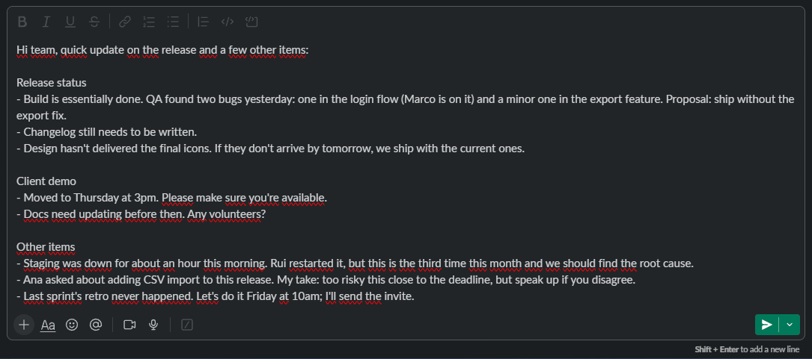
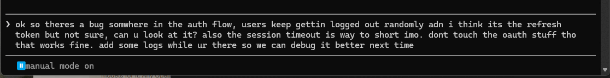

<p align="center">
  
</p>

<h1 align="center">Ember</h1>

<p align="center">
  <strong>Refine any text, in the moment, in any app.</strong><br>
  <em>Select text. Press a shortcut. Watch it sharpen in place.</em>
</p>

<p align="center">
  <a href="https://github.com/duartelcunha/Ember/stargazers"></a>
  <a href="https://github.com/duartelcunha/Ember/releases/latest"></a>
  
  
  <a href="https://tauri.app/"></a>
  
  
  <a href="LICENSE"></a>
</p>

---

<p align="center">
  
</p>

You know that half-written email, that clumsy Slack message, that messy prompt
you keep rewording? Select it, press one shortcut, and Ember cleans it up right
where it sits, no chat window, no copy-paste, no losing your place.

It lives quietly in your system tray. Highlight text in **any** app, hit the
global shortcut, and a small orb appears by your cursor while it rewrites your
selection in place. Your clipboard is put back exactly as it was.

Not just for AI prompts, Ember sharpens **anything** you can select: emails,
messages, commit bodies, docs, terminal commands, in whatever language you wrote
it. Fix the grammar and clarity, or restructure the whole thing, three modes let
you dial how far it goes.

**No window switching. No copy-paste dance. No tab you forgot to close.**

<br>

## Why Ember

|  |  |
|---|---|
| ⚡ **Refine any text in place** | A global hotkey captures your selection, sharpens it, and pastes the result over the original, then quietly restores your clipboard. Prompts, emails, messages, commits, docs, terminal commands, anywhere you can select text. |
| 🧬 **Never mangles your text** | Before the model ever sees it, Ember masks your code, URLs, file paths, and placeholders, then verifies they came back **exactly** intact. If anything is lost or the output looks wrong, it degrades: your original selection stays untouched instead of getting overwritten with something broken. |
| ✋ **You get the last word** | Turn on **Confirm before pasting** and Ember shows a tiny prompt by your cursor after refining, applying only when you press Enter (Esc keeps your original). It captures the keys without stealing focus, so Enter never leaks into the app you're in. |
| 🆓 **Runs on free tiers** | Primary is Google **Gemini**, whose free tier covers everyday personal use. The fallback is any **OpenAI-compatible** endpoint, defaulting to **Groq**: free, no credit card, and roughly 14,000 requests a day, so the safety net is actually there when you need it. Switch it to OpenAI or OpenRouter in one click, or point it at DeepSeek or a local Ollama. Free tiers do have daily caps; for heavy use, add a cheap paid key (Claude Haiku) as a third family. |
| 🛡️ **Resilient, not fragile** | A pure retry/fallback state machine handles rate-limits, truncation, content-policy, and outages. Fallbacks are pre-validated at startup, never guessed at the moment of failure. It degrades honestly instead of silently. |
| 🔒 **BYOK, strictly local** | Your API keys live in the Windows Credential Manager, never in plain text, never anywhere but the provider. |
| 🎭 **Knows your project** | Optionally merges the `CLAUDE.md` / `AGENTS.md` / `GEMINI.md` of your focused project into the refine, with secret-shaped lines redacted. Off by default. |
| 💫 **Silky, deliberate UI** | A living mark that morphs from rough to refined and leans toward your cursor as it works. Compositor-only animations tuned for 120fps, a seamless frameless window, and a warm **Dark** or **Cream** theme. Respects your reduced-motion setting. |

<br>

## Quick start

1. Grab the latest installer from the [**Releases**](https://github.com/duartelcunha/Ember/releases/latest) page.
2. Launch Ember. It settles into your system tray.
3. Open **Settings** and drop in a free API key. [Gemini](https://aistudio.google.com/apikey) and [Groq](https://console.groq.com/keys) are both free, need no credit card, and take a minute to grab. Each provider card has a button that opens the right page for you. *(Zero-key setup is on the [roadmap](#roadmap).)*
4. Select text anywhere and press `Ctrl+Shift+Space` (rebindable to any combo you like).
5. That's it, the polished version lands right where your text was.

> **Terminals are handled.** In Windows Terminal, PowerShell, and friends, Ember
> uses `Ctrl+Shift+C/V`, replaces the current input line instead of appending, and
> flattens the result to a single line so a stray newline never submits your command.

<p align="center">
  
  <br>
  <sub>A rough prompt in Claude Code's input line, refined in place.</sub>
</p>

<br>

## A closer look

**Confirm before pasting.** Turn this on and, after refining, a small pill waits
by your cursor: Enter applies, Esc keeps your original. Nothing lands without
your say-so. Ember captures those two keys without stealing focus, so the Enter
never leaks into the app you're in.

**Settings, in Cream or Dark.** Every provider card has a button that opens the
page where its key is created, so you never have to go hunting for it.

<p align="center">
  
</p>

<p align="center">
  
</p>

<br>

## The refine chain

Ember tries providers in priority order, keeping only the ones you've configured:

```
Gemini  →  OpenAI-compatible (Groq)  →  Claude
primary       default fallback         optional third family
```

The middle slot is any **OpenAI-compatible** endpoint. Pick the service in Settings
and Ember sets its models for you:

| Service | Cost | Why you'd pick it |
|---|---|---|
| **Groq** (default) | Free, no card | Roughly 14,000 requests a day. A safety net that is actually there when you need it. |
| **OpenAI** | Paid | Small models cost a fraction of a cent per refine and never wait in a queue. |
| **OpenRouter** | Free models | One key, many models, but the free ones are capped near 50 requests a day and get busy. |

Anything else that speaks the same protocol works too, including **DeepSeek** and a
local **Ollama**: paste its base URL and model id.

Transient errors retry with backoff on the same provider, honouring the server's
`Retry-After` instead of guessing, because retrying inside a cooldown just earns
another rate limit. If a server asks for longer than we're willing to wait, Ember
moves to the next family rather than stalling you. A key that is rejected, a model
that no longer exists, and a truncated answer all fall straight over to the next
family, which has a different key, a different model, and different limits.
Non-transient errors (a bad payload, a content-policy refusal) propagate without
masking. Every branch of this lives in `ember-core` as a pure, network-free,
unit-tested function.

<br>

## Stack

- **Shell:** Tauri 2 (Rust) - clipboard, input simulation, tray, windows.
- **Frontend:** React 19, Vite 7, Tailwind CSS 4, Motion.
- **Core:** the `ember-core` crate holds the refine pipeline, selection
  sequencing, provider wire-formats, and the resilience state machine, fully
  unit-tested with no I/O.

The split is deliberate: everything that can be reasoned about is pure and tested;
the shell is a thin layer of I/O around it.

<br>

## Development

```bash
npm install          # dependencies
npm run tauri dev    # run in dev (tray app + hot reload)
```

Default shortcut: `Ctrl+Shift+Space`. Everything is tweakable from Settings.

**Tests** (the whole workspace, matching CI):

```bash
cargo test --workspace
```

<br>

## Roadmap

Ember works great today on free BYOK keys. Where it's headed:

- **Zero-setup by default.** The next big step is dropping the bring-your-own-key
  requirement, a built-in engine so Ember refines out of the box with nothing to
  configure, and BYOK becomes an option for power users, not a prerequisite.
- **A local, on-device mode.** Refine fully offline with a small local model, for
  when you want zero network and total privacy.
- **macOS.** The core is already ported; it needs CI, signing, and real testing.
- **Per-app tone.** Adapt the refine to where you are, a crisp shell command in a
  terminal, a warm message in a chat app, a formal email in your mail client.

<br>

## Versioning & updates

- `package.json` is the single source of truth for the version.
- Releases are cut by [release-please](https://github.com/googleapis/release-please)
  from [Conventional Commits](https://www.conventionalcommits.org/); merging the
  standing release PR tags and publishes signed installers.
- **Auto-update** is built in: Ember checks the latest signed GitHub release and
  updates in place.

<br>

## License

[MIT](LICENSE). The Ember name and logo are trademarks.

<br>

---

<p align="center">
  <strong>If Ember saved you a copy-paste today, star it.</strong><br>
  <sub>It costs you a click and it's how other people find it.</sub>
</p>

<p align="center">
  <a href="https://github.com/duartelcunha/Ember/stargazers"></a>
</p>

<p align="center"><sub>Better words, wherever you write them. 🔥</sub></p>
